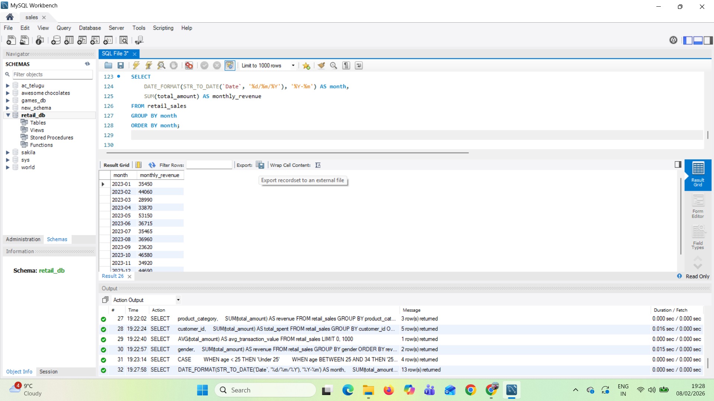

# 🛒 Retail Sales Analysis Using SQL (MySQL Workbench)

## 📌 Project Overview
This project focuses on analyzing a **retail sales dataset** using **SQL in MySQL Workbench** to extract meaningful business insights.  
The analysis covers revenue trends, customer behavior, product category performance, and monthly sales patterns.

The project demonstrates **end-to-end SQL skills**, including:
- Importing CSV data into MySQL
- Table structure validation and cleaning
- Writing analytical SQL queries
- Generating business insights from raw data

---

## 📂 Repository Contents
| File | Description |
|----|----|
| `retail_sales_dataset.csv` | Raw retail sales dataset used for analysis |
| `sqlquery.png` | Screenshot of SQL queries and results in MySQL Workbench |
| `README.md` | Project documentation |
| `LICENSE` | MIT License |

---

## 🛠 Tools & Technologies
- **Database:** MySQL  
- **IDE:** MySQL Workbench  
- **Language:** SQL  
- **Data Format:** CSV  

## 📊 Dataset Description
The dataset contains **1000 retail transactions** with the following attributes:

- Transaction ID  
- Date  
- Customer ID  
- Gender  
- Age  
- Product Category  
- Quantity  
- Price per Unit  
- Total Amount  

## 🔄 Data Preparation Steps
1. Created a new database: `retail_db`
2. Imported CSV data using **Table Data Import Wizard**
3. Verified table structure using `DESCRIBE`
4. Renamed columns for SQL compatibility
5. Converted text-based date column for time-based analysis

---

## 🔍 SQL Analysis Performed

### 1️⃣ Basic Exploration
- Total number of transactions
- Sample data preview
- Table structure inspection

### 2️⃣ Revenue Analysis
- Total revenue
- Average transaction value
- Revenue by product category

### 3️⃣ Customer Analysis
- Top 5 customers by total spending
- Revenue distribution by gender
- Age group segmentation

### 4️⃣ Time-Based Analysis
- Monthly sales trends using date formatting
- Revenue comparison across months

---

## 📸 SQL Queries & Results (MySQL Workbench)

Below is a screenshot showing the SQL queries executed in **MySQL Workbench**, including aggregations, grouping, and date-based analysis:

---

## 📈 Key Insights
- Identified **top-performing product categories**
- Observed **monthly revenue trends**
- Found **high-value customers**
- Calculated **average transaction value**

---

## 🚀 Key Learnings
- Practical use of `GROUP BY`, `ORDER BY`, `CASE`, `DATE_FORMAT`
- Handling column naming issues from CSV imports
- Converting string dates into SQL date formats
- Writing clean and readable analytical SQL queries

---

## 📜 License
This project is licensed under the **MIT License**.

---

## ✨ Author
**Sai Anirudh B**  
Aspiring Data Analyst | SQL | Power BI | Data Visualization  

⭐ If you find this project useful, consider giving it a **star** on GitHub!
